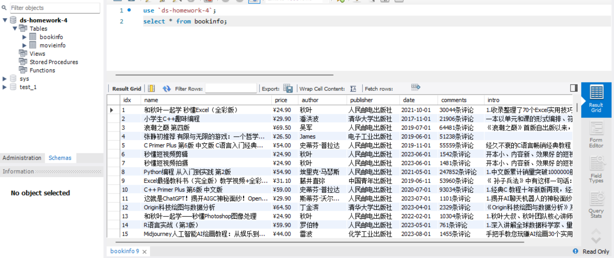

<h1>
    

    	DS-homework-5 Report
    

</h1>

<h3>
    

        朱维清 10215300402
    

</h3>

---

#### 1. 补全爬虫代码并将数据存至数据库，结果图示：

#### 2. Scrapy框架的优缺点

+ **优点**：
  + 灵活性：Scrapy 允许自定义数据提取规则，处理请求和响应，这使得它非常灵活，可以应对各种不同的网站结构。
  + 异步处理：支持异步请求和处理。这意味着它可以同时处理多个请求，提高了爬取效率；
  + 内置支持多个数据格式：Scrapy 可以处理多种数据格式，包括 HTML、XML、JSON 和其他自定义格式。
  + 数据存储支持：Scrapy 可以将爬取的数据存储到多种后端存储系统，如数据库、CSV 文件、JSON 文件等。
+ **缺点**：
  + 配置较复杂：需要编写一些配置文件和代码来设置和定义爬虫，略有复杂。
  + 并发限制：尽管 Scrapy 支持异步请求，但默认情况下，它可能受到主机服务器的并发连接限制。在大规模数据抓取时，可能需要在设置中进行调整以提高并发性能。

#### 3.4.5

+ 爬取到的内容打印在json文件中：
+ 传入数据库中：

#### 6.7.8

#### 9.

#### 10.

#### 11.

#### 12.

#### 13.

#### 14.

#### 15.

